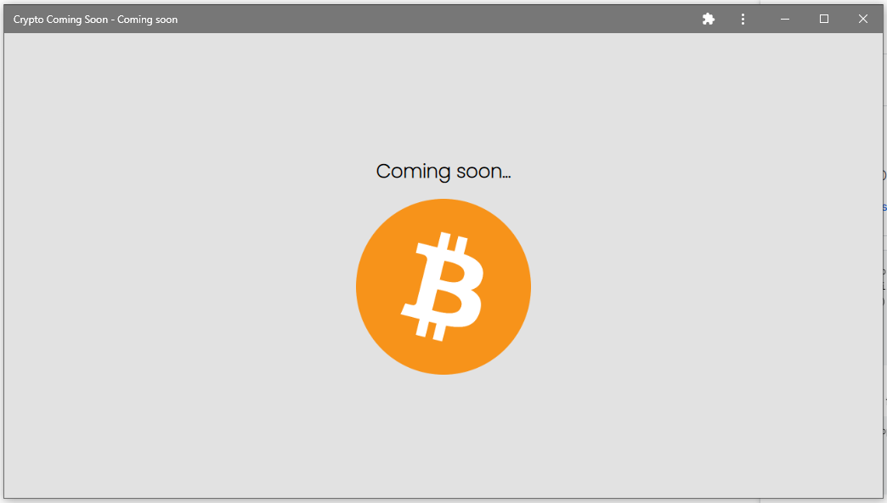

# Basic PWA 
This basic PWA (Progressive Web Application) showcases a coming soon page for a cyrpto trading app. It was made with HTML, CSS and JS.

## Features
- Basic cache implementation 
- Basic serviceWorker setup
- Basic manifest.json setup

## Notes
This project was a learning exercise to familiarize myself with the basics of PWAs.
